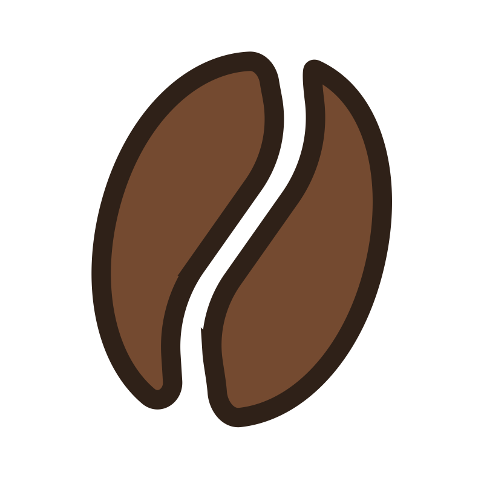

# C☕ffeeTrack

  

**C☕ffeeTrack** - це веб-додаток для обліку кави та рецептів ручного заварювання з інтеграцією AI-помічника.
Фінальний проєкт курсу Python/Django від BeetRooT Academy.

## Опис проєкту

CoffeeTrack допомагає баристам та любителям кави:

- Вести облік запасів кави (країна, обсмажка, метод обробки)
- Створювати та зберігати рецепти заварювання (V60, Kalita, AeroPress тощо)
- Генерувати рецепти за допомогою AI (Gemini API)
- Отримувати актуальні новини зі світу кави

## Функціонал

### Основний функціонал (MVP):

- Реєстрація та авторизація користувачів
- CRUD операції для кави (створення, перегляд, редагування, видалення)
- CRUD операції для рецептів заварювання
- Пошук кави за назвою
- Фільтрація кави за країною та рівнем обсмажки
- Фільтрація рецептів за методом приготування
- Пагінація списків (9 елементів на сторінку)
- Завантаження зображень для кави та рецептів

### Додатковий функціонал:

- **AI-помічник** - генерація рецептів через Google Gemini API
- **Новини** - RSS-стрічка з Daily Coffee News
- **Безпека** - доступ до редагування/видалення тільки для власників

## Технології

- **Backend**: Python 3.13, Django 5.2.8
- **Database**: SQLite
- **Frontend**: HTML5, CSS3, Bootstrap 5
- **AI**: Google Gemini API (gemini-2.5-flash)
- **Інше**: feedparser, python-dotenv, Pillow

## Використання

### Головна сторінка

- `/` - домашня сторінка з описом проєкту

### Кава

- `/coffees/` - список усієї кави
- `/coffees/create/` - додати нову каву
- `/coffees/<id>/` - деталі кави
- `/coffees/<id>/edit/` - редагувати каву (тільки власник)
- `/coffees/<id>/delete/` - видалити каву (тільки власник)

### Рецепти

- `/recipes/` - список усіх рецептів
- `/recipes/add/` - додати новий рецепт
- `/recipes/<id>/` - деталі рецепту
- `/recipes/<id>/edit/` - редагувати рецепт (тільки власник)
- `/recipes/<id>/delete/` - видалити рецепт (тільки власник)

### Новини

- `/news/` - останні новини зі світу кави

### Авторизація

- `/register/` - реєстрація нового користувача
- `/login/` - вхід
- `/logout/` - вихід

## Моделі даних

### Coffee (Кава)

- `name` - назва кави
- `country` - країна походження
- `roast_level` - рівень обсмажки (Light/Medium/Dark)
- `process_method` - метод обробки (Washed/Natural/Honey)
- `quantity` - кількість у грамах
- `owner` - власник (ForeignKey до User)
- `image` - фото кави (опціонально)

### Recipe (Рецепт)

- `title` - назва рецепту
- `method` - метод заварювання (V60/Kalita/AeroPress тощо)
- `description` - опис рецепту
- `ingredients` - інгредієнти
- `instructions` - покрокова інструкція
- `coffee` - прив'язка до кави (ForeignKey)
- `owner` - власник (ForeignKey до User)
- `image` - фото результату (опціонально)

## Безпека

- Паролі хешуються через Django authentication
- CSRF захист увімкнено
- LoginRequiredMixin для захищених сторінок
- UserPassesTestMixin для перевірки власника ресурсу

## TODO (можливі покращення)

- [ ] Додати тести (pytest + factory-boy)
- [ ] Додати API (Django REST Framework)
- [ ] Телеграм-бот для швидкого додавання кави
- [ ] Експорт рецептів у PDF
- [ ] Рейтинги та коментарі до рецептів
- [ ] Deployment на Railway або PythonAnywhere
- [ ] Зробити адаптив

---

**Дякую за увагу!**